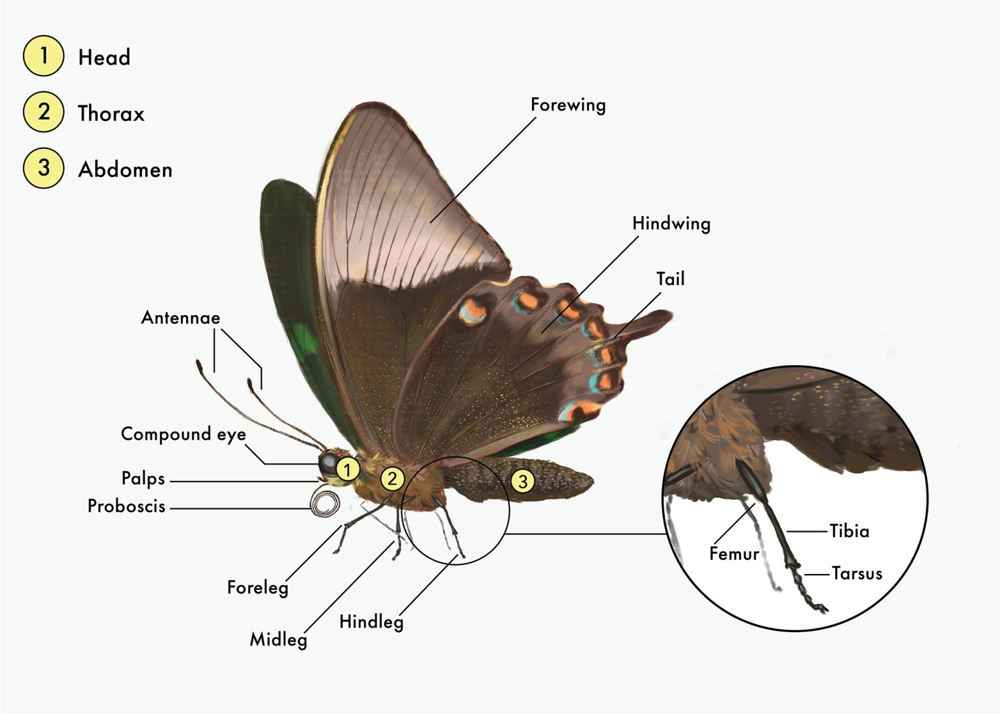

# Introduction:

The paraphyletic clade of butterflies and moths forms the order Lepidoptera, described as representing a "superradiation" of 160,000 extant species [@Kawahara2019]. Because of this extensive radiation, lepidopterans play a multitude of ecological roles in most (if not all) terrestrial ecosystems (@Duplouy2018), and it is therefore argued that several factors (ranging from environment to sexual selection) influence morphology.

<center></center>

Hindwings and forewings may not play the same role in flight. A study of powered flight without the hindwing revealed that lepidopterans could still fly without their hindwings, although not as fast and with less maneuverability [@Jantzen2008]. In fact, these authors concluded that the hindwings may contribute to survival, indicating the selection pressures between forewing and hindwing could differ. For example, since flight is conserved with the loss of the expanded hindwing, there may be a stabilizing selection pressure from the demands of flight. On the other hand, the hindwing may be under selection pressures related to predator avoidance (maneuverability and zigzaging behaviors) or even sexual selection.

Our study examines this relationship between wings. We seek to answer whether the rates of wing-shape evolution are different between the hind- and forewing, and if so, by how much. Additional questions include: Are hind- and forewing shapes correlated? What inferences can we make based on shape correlations and flight control?

# Methods:

A morphometric approach was used to conduct the project. Images of various species and specimens from Lepidoptera were obtained from Dr. Kenaley's work. Using the analysis program FIJI, outlines of both forewings and hindwings were traced digitally and fitted with a spline to produced lists of xy_coordinates for each specimen and wingtype. Shape analysis was outline-based. A generalized Procrustes transformation was used to superimpose and scale each object (outline) to minimize variability from arbitrary size differences. Next, Elliptical Fourier Analysis (EFA) was used to describe the shapes (outlines) in the dataset, followed by Principal Components Analysis to find the major types of variance in the data. Comparative analysis was conducted from the first two principal components for each wing type, annotated with species information. The 'non-censored test' method from @OMeara2006 was used in order to calculate the likelihood of evolutionary rates, using an estimation of of an ancestral trait under Brownian motion, across the entire phylogenetic tree of Lepidoptera (also obtained from Dr. Kenaley). Finally, shape evolution correlation was analyzed using phylogenetic independent contrasts (PIC) to regress the first and second principal components for forewings versus hindwings.

# Results:

```{r setup, include=FALSE}
knitr::opts_chunk$set(echo = FALSE)
library(tidyverse)
library(Momocs)
library(ape)
library(phytools)
```

```{r shape analysis, include=FALSE, warning=FALSE, message=FALSE}
f <- list.files("class_out_data_f23", full.names = TRUE)
out <- read_csv(f[1]) %>%
  as.matrix()

out.df <- vroom::vroom(f, id = "filename", progress = FALSE)
out.df <- out.df %>% #need to add wing info
  mutate(wing = gsub("XY_.+_(hindwing|forewing)\\..+", "\\1", basename(filename))) %>%
  na.omit()
out.l <- sapply(f, function(x) out.df %>% filter(filename == x) %>% select(X,Y) %>% as.matrix())
wings <- gsub("XY_.+_(hindwing|forewing)\\..+", "\\1", basename(names(out.l)))

outs <- out.l %>% #store wing info in outlines!
  Out(fac = list(wing = wings)) %>%
  coo_flipx()
forewings <- outs %>%
  filter(wing == "forewing")
hindwings <- outs %>%
  filter(wing == "hindwing")

#use Procrustes alignment to not have variance due to simple size issue then EFA and PCA
fore.min <- forewings %>% #need same number coordinates
  coo_nb() %>%
  min()
hind.min <- hindwings %>%
  coo_nb() %>%
  min()

fore.pca <- forewings %>%
  coo_interpolate(fore.min) %>%
  coo_align %>%
  fgProcrustes() %>%
  efourier(norm = FALSE) %>%
  PCA()
hind.pca <- hindwings %>%
  coo_interpolate(hind.min) %>%
  coo_align() %>%
  fgProcrustes() %>%
  efourier(norm = FALSE) %>%
  PCA()
```

```{r pca plots, echo=FALSE, warning=FALSE, fig.width=6, fig.asp=0.618, message=FALSE, out.width="50%", fig.align="default"}
plot_PCA(fore.pca, title="Figure 1: Forewing PCA")
plot_PCA(hind.pca, title="Figure 2: Hindwing PCA")
```

Figure 1 graphically represents the results of principal components analysis for the forewings. The first principal component describes approximately 55% of the variance across the forewing data. This suggests variance due to wing shape: as the horizontal axis progress from left to right, the rounded triangular appearance of the wing thins out to a flattened elliptical shape. The second principal component describes approximately 18% of the variance for the forewing data. This corresponds more to variance in size rather than shape: moving down to up across the vertical axis does not result in a full loss of shape, but a larger 'version' of the forewing. This first PCA accounts for a combined 73% of variance in the forewing data.

For hindwing data, the first principal component accounts for 49.7% of variance while the second principal component accounts for 30.6% of variance. While the distinction is slightly more difficult to make, it appears that, like the forewing variance, the first principal component describes variance due to shape while the second principal component describes variance due to size. In total, the first two principal components for the hindwing data account for approximately 80.3% of variance.

```{r comparative analysis prep, results="hide", warning=FALSE, message=FALSE}
#remember question 1: do forewings and hindwings vary in their evolutionary rates?
  #can just evaluate the evolutionary rate of PC scores for the fore/hindwings using some method of choice
#for question 2: do major groups of Lepidoptera vary in their hindwing and forewing evolvability?
  #can just do above but looking at PC scores across the Lepidopteran evolutionary tree! 

lep.tree <- ape::read.tree("lep_tree2.tre") %>%
  ladderize()
lep.tree$tip.label <- gsub("_", " ", lep.tree$tip.label)

#each species is represented in our outs list by the filename from its outline:
lep.spp <- read_csv("lep_image_data.csv")
lep.spp$identifier #yup ew
out.data <- tibble(xy.file = basename(names(outs))) %>%
  mutate(identifier = gsub("XY_|_hindwing|_forewing|.txt|.csv","",xy.file)) %>%
  left_join(lep.spp)

#now we can add species info to our PCA data since PC scores are stored under variable x:
hind.pca2 <- tibble(xy.file = basename(rownames(hind.pca$x)), PC1=hind.pca$x[,1], PC2=hind.pca$x[,2]) %>%
  left_join(out.data)
fore.pca2 <- tibble(xy.file = basename(rownames(fore.pca$x)), PC1=fore.pca$x[,1], PC2=fore.pca$x[,2]) %>%
  left_join(out.data) 
#and now we have PCs 1 and 2 for both fore/hindwing stored with species info --> we can do comparative analysis
```

```{r evolutionary rates, results="hide", fig.keep="all", warning=FALSE, message=FALSE}
#method to estimate the rates of morphological evolution over a phylogenetic tree here is "noncensored test"
  #uses the entire varian-ecovariance matrix (established by the phylogeny) to calculate the likelihood of      rates across the tree
  #one ancestral state is estimated under Brownian motion for the entire tree and the the optimal rate          parameter values are estimated numerically until the likelihood of the model is maximized

keep <- intersect(unique(out.data$species),lep.tree$tip.label) #spp in both tree and data
lep.tree2 <- keep.tip(lep.tree, keep)
plot(lep.tree2, cex=0.1, main = "Figure 3: Modified Phylogenetic Tree of Lepidoptera")

#establishing named vector of values for PC1
hind.pc1 <- hind.pca2 %>%
    filter(species %in% lep.tree2$tip.label) %>%
  group_by(species) %>%
  summarize(PC1 = mean(PC1)) %>%
  pull(PC1)
names(hind.pc1) <- hind.pca2 %>%
    filter(species %in% lep.tree2$tip.label) %>%
  group_by(species) %>%
  summarize(PC1 = mean(PC1)) %>%
  pull(species)

fore.pc1 <- fore.pca2 %>%
  filter(species %in% lep.tree2$tip.label) %>%
  group_by(species) %>%
  summarize(PC1 = mean(PC1)) %>%
  pull(PC1)
names(fore.pc1) <- fore.pca2 %>%
  filter(species %in% lep.tree2$tip.label) %>%
  group_by(species) %>%
  summarize(PC1 = mean(PC1)) %>%
  pull(species)

#and for PC2:
hind.pc2 <- hind.pca2 %>%
  filter(species %in% lep.tree2$tip.label) %>%
  group_by(species) %>%
  summarize(PC2 = mean(PC2)) %>%
  pull(PC2)
names(hind.pc2) <- hind.pca2 %>%
  filter(species %in% lep.tree2$tip.label) %>%
  group_by(species) %>%
  summarize(PC2 = mean(PC2)) %>%
  pull(species)

fore.pc2 <- fore.pca2 %>%
  filter(species %in% lep.tree2$tip.label) %>%
  group_by(species) %>%
  summarize(PC2 = mean(PC2)) %>%
  pull(PC2)
names(fore.pc1) <- fore.pca2 %>%
  filter(species %in% lep.tree2$tip.label) %>%
  group_by(species) %>%
  summarize(P21 = mean(PC2)) %>%
  pull(species)

fore.pc1.BM <- brownie.lite(lep.tree2, fore.pc1*10)
hind.pc1.BM <- brownie.lite(lep.tree2, hind.pc1*10)
fore.pc2.BM <- brownie.lite(lep.tree2, fore.pc2*10)
hind.pc2.BM <- brownie.lite(lep.tree2, hind.pc2*10)
```

As aforementioned, the Lepidoptera phylogenetic tree was obtained from Dr. Kenaley, and modified to retain only the species found in the principal components analysis data.

The evolutionary rate for the forewing dataset's first principal component is `r fore.pc1.BM$sig2.single`, while the evolutionary rate for the forewing dataset's second principal component is `r fore.pc2.BM$sig2.single`. These values corresponding to the hindwing dataset are `r hind.pc1.BM$sig2.single`, and `r hind.pc2.BM$sig2.single` respectively.

```{r shape evolution correlation, echo=FALSE, warning=FALSE, message = FALSE, fig.width=6, fig.asp=0.618, out.width="50%", fig.align="default"}
#instead of doing PGLS, we can keep it simple and do phylogenetic independent contrasts (PIC) analysis
  #uses phylogenetic information (under a Brownian-motion like model) to transform the original tip data        into values that are statistically independent of one another
hindPC1.pic <- pic(hind.pc1,phy = lep.tree2)
forePC1.pic <- pic(fore.pc1,phy = lep.tree2)
hindPC2.pic <- pic(hind.pc2,phy = lep.tree2)
forePC2.pic <- pic(fore.pc2,phy = lep.tree2)

PC1.pic <- tibble(
  hind=hindPC1.pic,
  fore=forePC1.pic)
PC1.pic %>% 
  ggplot(aes(x=fore,y=hind))+geom_point() + geom_smooth(method="lm") + ggtitle("Figure 4: Regressing first principal component for hindwing vs. forewing") #the PC1s look correlated

PC2.pic <- tibble(
  hind=hindPC2.pic,
  fore=forePC2.pic)
PC2.pic %>% 
  ggplot(aes(x=fore,y=hind))+geom_point()+geom_smooth(method="lm") + ggtitle("Figure 5: Regressing second principal component for hindwing vs. forewing") 
```

The p-values for each regression model (first principal component and second principal component, respectively) are `r summary(lm(hind~fore,PC1.pic))$coefficients[2,4]` with r squared value `r summary(lm(hind~fore,PC1.pic))$r.squared`, and `r summary(lm(hind~fore,PC2.pic))$coefficients[2,4]` with r squared value `r summary(lm(hind~fore,PC2.pic))$r.squared`.


# Discussion:

As aforementioned in the Results section, the first principal component for both forewing and hindwing data describes wing variance in shape, while the second principal component describes variance in wing size. 
Because a rate is a change of something (here of a wing phenotype - size or shape depending on the principal component being evaluated) during a period of time, larger evolutionary rates indicate more change per period of time, or a faster evolution of a trait. Both first principal components for each dataset represent a variance in shape. Since the evolutionary rate for the first principal component is larger in the hindwing data than in the forewing data (~ 0.00802 > 0.00468), it can be inferred that there is a larger rate of change/evolution in hindwing shape than in forewing shape. Similarly, the rate corresponding to the second principal component was also larger in the hindwing data than that of the forewing data (~ 0.00900 > 0.00397), suggesting that the rate of evolution in hindwing size is larger than in forewing shape. In fact, for both shape and size, the evolutionary rate is about twice as large for hindwings than for forewings. 
In terms of wing evolution correlation, the regression plot for the first principal component shows a significant positive correlation relationship for shape evolution between forewings and hindwings, with an r-squared value of 0.4708. On the other hand, the regression plot for the second principal component shows no correlation or significant relationship for size evolution between forewings and hindwings. 
These findings are consistent with other recent studies on the evolution of wings for butterflies and moths, one of which concluded that "forewings and hindwings are evolving independently" [@Owens2020]. Our study contributes to indications that hindwings and forewings that evolve independently, but advances this to a much larger phylogenetic sample. This also speaks to different selection pressures of powered flight or ecology. However, there is reasonable evidence that there is a correlation of shape evolution between forewings and hindwings, which could be due to differences in independent or linked shape evolution between species (such as specific genetic processes or phylogenetic influences). More research is required, and it could prove insightful to analyze different species of Lepidoptera.

# Author Contributions:

* Jaan:
  + FIJI Image Outlining
  + R code setup, including analysis
  + Introduction
  + Methods
  + Results
  + Discussion
  + Bibliography
  
* Stacey:
  + ...
  
* Jessica:
  + ...

# References:
